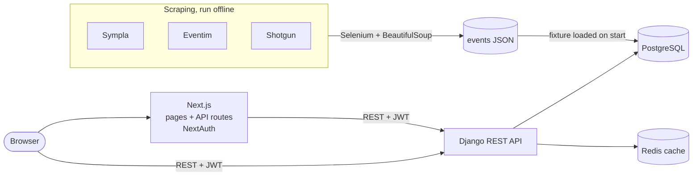

<p align="center">
  
</p>

# Chegados

A web app for finding social events in Fortaleza. It collects events from ticketing sites (Sympla, Eventim, Shotgun), shows them in a feed grouped by category, and lets users filter them, confirm they're going, and keep a history of the events they attended. The product name in the UI is Toggo.

Built with a team of four between May and July 2025. My part was the Django API and data model, the Docker Compose setup, the NextAuth + JWT integration, and wiring the feed, participation, "my events" and profile pages to the backend.

## Features

- Sign up and log in (NextAuth credentials provider backed by Django JWT)
- Feed with a highlights carousel and one carousel per category
- Search, and filters by category and rating
- Event details side panel with link to the ticketing page
- Confirm presence in an event; list of confirmed events and event history
- Profile page and light/dark theme

## Architecture



- **Frontend** (`react_app/`): Next.js with the pages router, TypeScript and MUI. NextAuth handles the session: its credentials provider calls Django's `/auth/token/`, fetches the user and keeps the access token in the session JWT. Pages call the API directly with that token; a few Next.js API routes proxy calls that need the server-side session.
- **Backend** (`django_app/`): Django REST Framework with SimpleJWT, django-filter and Swagger (drf-yasg). Models: `SocialEvent`, `SocialEventLike` and `Participation` (unique per user and event, with an optional rating).
- **Data**: the scrapers in `scraping/` write a normalized JSON (`title`, `link`, `date`, `location`, `img_url`, `categoria`, `description`). The backend container loads `django_app/fixtures/social_events.json` on start; `python manage.py import_events` loads the raw scraper output instead.
- **Infrastructure**: Docker Compose runs Postgres, Redis, RedisInsight, the backend and the frontend.

## Stack

| Layer | Technology |
| --- | --- |
| Frontend | Next.js 15 (pages router), React 18, TypeScript, MUI 5, NextAuth 4, axios, react-slick |
| Backend | Django 5.2, Django REST Framework, SimpleJWT, django-filter, drf-yasg |
| Data | PostgreSQL 14, Redis |
| Scraping | Selenium, BeautifulSoup |
| Infrastructure | Docker Compose |

## Running

Requirements: Docker and Docker Compose.

```bash
cp django_app/.env.example django_app/.env
cp react_app/.env.example react_app/.env

docker compose up --build -d
docker compose exec backend python manage.py createsuperuser   # optional, for /admin
```

| Service | URL |
| --- | --- |
| Frontend | <http://localhost:3000> |
| API | <http://localhost:8000> |
| Swagger | <http://localhost:8000/swagger/> |
| Django admin | <http://localhost:8000/admin/> |
| RedisInsight | <http://localhost:5540> |

Without Docker (Postgres and Redis still need to be running):

```bash
cd django_app
python -m venv venv && source venv/bin/activate
pip install -r requirements.txt
python manage.py migrate
python manage.py loaddata fixtures/social_events.json
python manage.py runserver

cd ../react_app
yarn install
yarn dev
```

## API

| Method | Route | Description |
| --- | --- | --- |
| POST | `/auth/register/` | Create a user |
| POST | `/auth/token/` | Get an access and refresh token |
| POST | `/auth/token/refresh/` | Refresh the access token |
| GET | `/users/?username=` | Look up a user |
| GET | `/social_events/?location=` | List events |
| GET, POST, DELETE | `/social_events_likes/` | The current user's saved events |
| GET, POST, PATCH | `/participations/` | The current user's confirmed events |
| GET | `/participations_events/?user=` | Participations with the full event nested |

## Project layout

```text
django_app/     Django project and the chegados_api app (models, serializers, views, fixtures)
react_app/      Next.js frontend, NextAuth config and API routes
scraping/       Selenium scrapers and their JSON output
docker-compose.yaml
```

## Known limitations

- The frontend runs in dev mode in Docker. `next build` currently fails on TypeScript errors in the feed and event pages (event types drifted between the scraped JSON and the API response).
- Event ratings and times shown in the feed are placeholders; the API does not store them yet.
- The phone verification step in sign-up is a UI mock.
